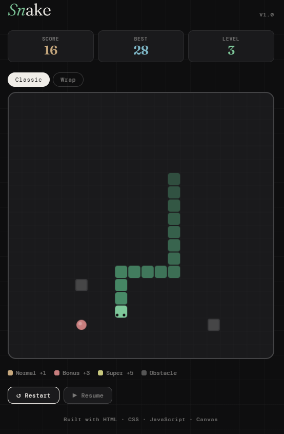

# 🐍 Snake

A fully-featured Snake game built with vanilla HTML, CSS, and JavaScript — rendered on HTML5 Canvas. No frameworks, no dependencies.

[](https://rakibulislamnayan.github.io/snake-js)
[](https://github.com/rakibulislamnayan/snake-js)

---

## ✨ Features

- **Classic mode**: walls kill you
- **Wrap mode**: snake passes through edges
- **3 food types**: Normal (+1), Bonus (+3), Super (+5)
- **Obstacles**: randomly placed blocks that increase with level
- **Speed scaling**: snake gets faster as your score grows
- **10 difficulty levels**: level up every 8 points
- **High score tracking**: saved in localStorage across sessions
- **Mobile D-pad**: touch-friendly controls on mobile
- **Keyboard support**: arrow keys to move, Space to pause
- **Pause / resume**: take a break mid-game
- **Smooth Canvas rendering**: animated eyes, gradient snake body, food shine effect
- **Zero dependencies**: pure HTML, CSS, JavaScript

---

## 🚀 Live Demo

👉 [Play it here](https://rakibulislamnayan.github.io/snake-js)

---

## 📸 Screenshot



---

## 🕹️ Controls

| Action | Keyboard | Mobile |
|---|---|---|
| Move | Arrow keys | D-pad buttons |
| Pause | Space bar | Pause button |
| Restart | Restart button | Restart button |

---

## 🍎 Food Types

| Food | Points | Description |
|---|---|---|
| 🟡 Normal | +1 | Appears most often |
| 🔴 Bonus | +3 | Rare, worth more |
| 🟨 Super | +5 | Very rare, big reward |

---

## 🛠️ Tech Stack

| Technology | Usage |
|---|---|
| HTML5 Canvas | Game rendering |
| CSS3 | UI styling, layout, dark theme |
| Vanilla JavaScript | Game loop, collision detection, state |
| localStorage | High score persistence |

---

## 🧠 How It Works

- **Game loop**: `setInterval` drives the tick at variable speed based on level
- **Collision detection**: checks head position against walls, self, and obstacles each tick
- **Food spawning**: weighted random selection between 3 food types
- **Speed scaling**: interval decreases every 8 points scored, up to level 10

---

## 📂 Project Structure

```
snake-js/
├── index.html       ← entire game in one file
├── README.md        ← this file
└── screenshot.png   ← gameplay screenshot
```

---

## ▶️ Run Locally

```bash
git clone https://github.com/rakibulislamnayan/snake-js.git
cd snake-js
open index.html
```

---

## 🌐 Deploy to GitHub Pages

1. Push this repo to GitHub
2. Go to **Settings → Pages**
3. Set source to `main` branch, `/ (root)`
4. Live at `https://rakibulislamnayan.github.io/snake-js`

---

## 📌 What I Learned

- **HTML5 Canvas API**: rendering shapes, arcs, and custom drawing
- **Game loop architecture**: tick-based movement with variable speed
- **Collision detection**: efficient array-based checks
- **localStorage**: persisting data across browser sessions
- **Mobile touch controls**: building responsive D-pad UI

---

## 📬 Connect

Made by **Md. Rakibul Islam Nayan** · [LinkedIn](https://www.linkedin.com/in/rakibul-islam-nayan/) · [GitHub](https://github.com/rakibulislamnayan)

---

